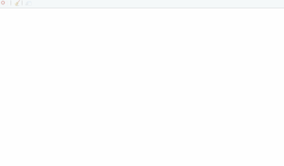
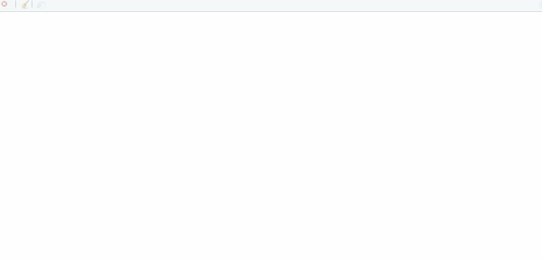

## Preview for developers

Warning: the package has not reached stable version.

-----

## R package `sketch`

Creates interactive illustrations embeddable in RMarkDown documents. The
package compiles R code into JavaScript code by applying rewriting rules
to the R AST. This allows users to develop JS-style visualisations using
only the R syntax.


-----

## News

  - 2019-12-01: Added `readme.md`: “Preview for developers”

-----

## Index

1.  [Preliminaries](#1-Preliminaries)
    
    [1.1 Installation](#11-Installation)
    
    [1.2 Run a sketch R file](#12-Run-a-sketch-R-file)
    
    [1.3 Embed a sketch R file in RMarkDown document](#13-Embed-a-sketch-R-file-in-RMarkDown-document)

2.  [Basic examples](#2-Basic-examples)
    
    [2.1 p5.js](#21-p5js)
    
    [2.2 DOM manipulation](#22-DOM-manipulation)
    
    [2.3 d3.js](#23-d3js)
    
    [2.4 JQuery Quiz](#24-JQuery-Quiz)

3.  [Notes](#3-Notes)
    
    [3.1 Special operators](#31-Special-operators)
    
    [3.2 Common pitfalls (of writing JS in R)](#32-common-pitfalls-of-writing-js-in-r)

-----

## 1\. Preliminaries

### 1.1 Installation

``` r
# install.packages("devtools")
devtools::install_github("kcf-jackson/sketch")
```

### 1.2 Run a sketch R file

There are two ways to run a sketch R file.

1.  If you use RStudio, there is an add-in “source a sketch R file”
    listed under this package (consider binding that to the key
    combination alt-shift-s), and that sources the active tab in the
    editor.

2.  Save the sketch R file (with the usual .R extension), then call
    `sketch::source_r` with it.

### 1.3 Embed a sketch R file in RMarkDown document

Simply use `sketch::insert_sketch` in a code chunk:

``` r
sketch::insert_sketch(
  file = "main.R", id = "sketch_1",
  width = 800, height = 600
)
```

Note that `sketch::insert_sketch` will create a temporary folder at the
working directory.

-----

## 2\. Basic examples

### 2.1 [p5.js](https://p5js.org/)

The functions `setup`, `draw`, `createCanvas`, `background`,
`frameCount`, `fill` and `circle` are from the `p5.js` library, and one
can use them as they are in the R code. This also works for *all* the
other functions in the
library.

``` r
#! load_script(src = "https://cdnjs.cloudflare.com/ajax/libs/p5.js/0.9.0/p5.js")

setup <- function() {
    createCanvas(400, 300)
}

draw <- function() {
    background(0, 0, 33)    # RGB colors

    for (i in 1:3) {
        dia <- sin(frameCount * 0.025) * 30 * i
        fill(255, 70 * i, 0)       # RGB colors
        circle(100 * i, 150, dia)   # (x, y, diameter)    
    }
}
```


### 2.2 DOM manipulation

The variable `document` and all of its methods are available, and
attributes also work as expected. (Of course it works, because we are
really writing JavaScript\!)

Here we also demonstrate how to source one sketch file in another. At
the moment, the working path must be at the parent directory of your
sketch file for the source-directive to work. This will be fixed in the
later release.

#### helper.R (R-style abstraction)

``` r
# Create a new DOM element with class and innerText
dom <- function(tag_name, class_name, inner_text) {
    declare (el)
    el <- document$createElement(tag_name)   # document and its methods are available!
    el$className <- class_name   # attributes also works as expected
    el$innerText <- inner_text
    return (el)
}

# Insert a DOM element into another
insert_into <- function(x, y) {
    document$querySelector(y)$appendChild(x)
}
```

Be aware that the word `class` is a keyword in JavaScript.

#### main.R

``` r
#! load_script("helper.R")

# Textbox
textbox <- dom("div", "text-box-1", "Hello World!")

# Two buttons
button_1 <- dom("button", "button-1", "1")
button_1$type <- "button"
button_1$onclick <- function() { textbox$innerText <- "Hello again!" }

button_2 <- dom("button", "button-2", "2")
button_2$type <- "button"
button_2$onclick <- function() { textbox$innerText <- "Bye!" }

# html
insert_into(textbox, "body")
insert_into(button_1, "body")
insert_into(button_2, "body")
```


This gives a simple way to create a narrative along with your data
visualisation.

### 2.3 [d3.js](https://d3js.org/)

Here we learn about how to source a data file with a slightly more
elaborate example using `d3.js`.

#### data.json

``` js
[
  {"x": [1, 2, 3, 4, 5], "y":[2, 9, 6, 2, 10], "r": [2, 4, 6, 8, 10]},
  {"x": [1, 2, 3, 4, 5], "y":[8, 3, 10, 5, 5], "r": [9, 7, 5, 3, 1]}
]
```

#### helper.R (creates reusable R-style components)

``` r
create_canvas <- function(width, height) {
    d3$select("body")$append("svg")$   # alternatively one can select "#new_sketch", which
        attr("width", width)$          # is the default placeholder for a sketch file
        attr("height", height)
}

linear_scale <- function(from, to) {
    return(d3$scaleLinear()$domain(from)$range(to))
}

draw_circles <- function(data0, scales) {
    declare (data_id, selection0)

    data_id <- 0:(length(data0$x) - 1)
    selection0 <- d3$select("svg")$selectAll("circle")$data(data_id)

    # add new circles
    selection0$enter()$
        append("circle")$
        attr("cx", d %=>% scales$x(data0$x[d]))$
        attr("cy", d %=>% scales$y(data0$y[d]))$
        attr("r", d %=>% scales$r(data0$r[d]))

    # update existing circles
    selection0$
        transition()$duration(300)$
        attr("cx", d %=>% scales$x(data0$x[d]))$
        attr("cy", d %=>% scales$y(data0$y[d]))$
        attr("r", d %=>% scales$r(data0$r[d]))

    # remove old circles
    selection0$exit()$remove()
}
```

#### main.R

``` r
#! load_script("https://d3js.org/d3.v5.min.js")
#! load_script("helper.R")
#! load_script("data.json")

# Data
# The data is now available in the data_json variable.
stage_1 <- data_json[0]   # JavaScript uses 0-based indexing
stage_2 <- data_json[1]

# Canvas and Scales
create_canvas(600, 400)
margin <- 50
scales <- list(
    x = linear_scale(c(1, 5), c(margin, 600 - margin)),
    y = linear_scale(c(1, 10), c(400 - margin, margin)),
    r = linear_scale(c(1, 10), c(10, 50))
)

# Initialisation
draw_circles(stage_1, scales)
current <- 1
document$querySelector("body")$onclick <- function() {
    if (current == 1) {
        draw_circles(stage_2, scales)
        current <<- 2   # careful with super-assign
    } else {
        draw_circles(stage_1, scales)
        current <<- 1   # careful with super-assign
    }
}
```



### 2.4 JQuery Quiz

#### helper.R

``` r
# Create a new DOM element with class and innerText
dom <- function(tag, id) {
    declare (el)
    el <- document$createElement(tag)
    el$id <- id
    return(el)
}

insert_into <- function(x, y) {
    document$querySelector(y)$appendChild(x)
}
```

#### simple\_interface.R

``` r
#! load_script("helper.R")

start_button <- dom("a", "quiz-start-btn")
start_button$href <- "#"
start_button$class <- "quiz-button"
start_button$innerText <- "Start"

insert_into(dom("div", "quiz-header"), "#new_sketch")
insert_into(dom("div", "quiz-start-screen"), "#new_sketch")
insert_into(start_button, "#new_sketch")
```

#### main.R

Note that since the symbol `$` has special meaning in R, the JavaScript
`$` is mapped to the symbol
`jQuery`.

``` r
#! load_script("https://ajax.googleapis.com/ajax/libs/jquery/1.8.2/jquery.min.js")

# Source: https://github.com/jchamill/jquery-quiz
#! load_script("./jquery.quiz.css")
#! load_script("./jquery.quiz.js")

#! load_script("simple_interface.R")

quiz_db <- list(
    counterFormat = 'Question %current of %total',
    questions = c(
        list(
            q= 'A sample question?',
            options= c('Answer 1', 'Answer 2', 'Answer 3', 'Answer 4'),
            correctIndex = 1,
            correctResponse = 'Custom correct response.',
            incorrectResponse = 'Custom incorrect response.'
        ),
        list(
            q= 'A new question?',
            options= c('Answer 1', 'Answer 2'),
            correctIndex = 0,
            correctResponse = 'Custom correct response.',
            incorrectResponse = 'Custom incorrect response.'
        )
    )
)

jQuery('#new_sketch')$quiz(quiz_db)
```

Note that the element `#new_sketch` is always there in a sketch file
(but this may be subject to removal in the future).



<!-- ### 2.5 Others -->

<!-- (GSAP)[https://greensock.com/] -->

<!-- (Vega)[https://vega.github.io/vega/] -->

<!-- (Plotly)[https://plot.ly/javascript/] -->

-----

## 3\. Notes

### 3.1 Special operators

#### `#! load_script()`

Use `#!` together with `load_script` to load any JavaScript library, CSV
/ JSON data file or an other sketch R file.

  - If the data file is named as `my_file.json`, then it will be
    available in the variable `my_file_json`. The data variable is not
    supposed to be modified (and is assigned the `const` tag). If one
    needs to change the data, please proceed by making a copy.

  - The package does not resolve circular referencing, i.e. file A and
    file B source each other at the same time. Please avoid that\!

#### `declare()` / `let()`

`declare()` / `let()` are empty R functions that act as a placeholder to
facilitate conversion into JavaScript. If you want to assign a value to
a variable, you may proceed as:

``` r
declare (x)
x <- 3
# alternative
let (x = 3)
```

Note that `declare` and `let` are 100% interchangable, e.g. `declare (x
= 3)` is also valid. I prefer using `declare` for top-level variable
declaration and `let` for local use.

If one uses variables without declaring them, JavaScript will declare it
for you and place them in the global namespace.

#### `%=>%` and `%+%`

  - `%=>%` maps to the arrow function `=>` in JavaScript.

  - `%+%` maps to `+` in JavaScript. The reason for creating this
    operator is that R does not perform string addition, while JS does.
    One may think of `%+%` as the semantic equivalent of `paste0`.
    Indeed,
    
    ``` r
    `%+%` <- paste0
    "a" %+% "b" %+% "c"  # gives "abc"
    ```

#### `lambda`

The `lambda` function offers a convenient way to define anonymous
function, which works similar to `pryr::f`. For instance, `function(x,
y) { return(x + y) }` can be rewritten as `lambda(x, y, x + y)`.

### 3.2 Common pitfalls (of writing JS in R)

#### i. JavaScript uses 0-based indexing

``` js
// Web-browser console
x = [1,2,3]
x[0]  // 1
```

#### ii. JavaScript function reads argument by position / order

``` js
// Web-browser console
first = function(x, y) { console.log(x) }
first(y = 3, x = 1)  // 3
```

Possible workaround: Use *destructuring* to mimic named arguments.

#### iii. `return` in JavaScript function must be explicit

``` js
add = function(x, y) { x + y }
add(3, 4) // undefined

add2 = function(x, y) { return(x + y) }
add(3, 4) // 7
```

#### iv. JavaScript passes objects by reference (think `R6` in R)

``` js
// Web-browser console
x = [1,2,3]    // Array(3) [ 1, 2, 3 ]
y = x          // Array(3) [ 1, 2, 3 ]
y[0] = 999
y              // Array(3) [ 999, 2, 3 ]
x              // Array(3) [ 999, 2, 3 ]
```

Workaround: Use `y = x.slice()` to make a copy of array.

#### v. A browser session has a pre-populated namespace

  - e.g. the variables `document`, `window`, `location`, `var`, `stop`,
    `open`, `focus` are taken already. *Avoid assigning values to these
    variables\!*

  - The full list can be found by typing in the console of a browser:

<!-- end list -->

    // Web-browser console
    for (let b in window) {
        if (window.hasOwnProperty(b)) console.log(b);
    }
