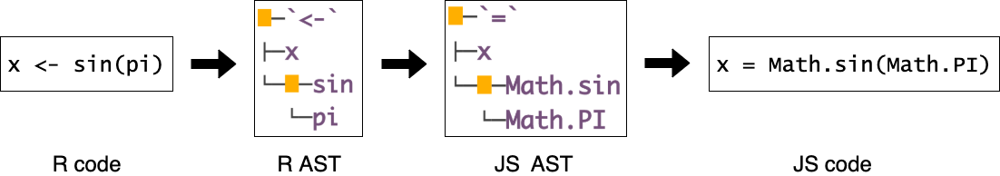
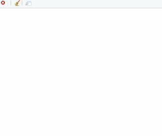

```{r, include = FALSE}
knitr::opts_chunk$set(
  collapse = TRUE,
  comment = "#>"
)
```

## The R package `sketch`

Creates interactive illustrations embeddable in RMarkDown documents. The package compiles R code into JavaScript code by applying rewriting rules to the R AST. This allows users to develop JS-style visualisations using only the R syntax.


**Figure 1. Illustration of the rewriting process.**
<!--  -->

---


## 1. Preliminaries {#section-1}

### 1.1 Installation {#section-1-1}

```{r, eval = FALSE}
install.packages("sketch")

# Or for the latest development 
install.packages("devtools")
devtools::install_github("kcf-jackson/sketch")
```

### 1.2 Running a sketch R file {#section-1-2}

There are two ways to run a sketch R file. 

1. Save the sketch R file (with the usual .R extension), then call `sketch::source_r` with it.

2. If you use RStudio, there is an add-in "source a sketch R file" listed under this package (consider binding that to the key combination alt-shift-s), and that sources the active tab in the editor. 


### 1.3 Embedding a sketch R file in RMarkDown document {#section-1-3}

Simply use `sketch::insert_sketch` in a code chunk:

```{r, eval = FALSE}
sketch::insert_sketch(
  file = "main.R", id = "sketch_1",
  width = 800, height = 600
)
```
where `file` is the path to the sketch file, `id`, `width` and `height` are the identifier, width and height of the sketch. (The identifier is needed to manage multiple sketches in the same Rmd document.)

---


## 2. Basic examples {#section-2}

### 2.1 [p5.js](https://p5js.org/) {#section-2-1}

The functions `setup`, `draw`, `createCanvas`, `background`, `frameCount`, `fill` and `circle` are from the `p5.js` library, and one can use them as they are in the R code. This also works for *all* the other functions in the library.

```{r, eval = FALSE}
#! load_script(src = "https://cdnjs.cloudflare.com/ajax/libs/p5.js/0.9.0/p5.js")
setup <- function() {
    createCanvas(400, 300)
}

draw <- function() {
    background(0, 0, 33)    # RGB colors

    for (i in 1:3) {
        dia <- sin(frameCount * 0.025) * 30 * i
        fill(255, 70 * i, 0)       # RGB colors
        circle(100 * i, 150, dia)   # (x, y, diameter)    
    }
}
```


### 2.2 DOM manipulation {#section-2-2}

The web browser variable `document` and all of its methods are available, and DOM attributes also work as expected. 

#### helper.R
```{r, eval = FALSE}
# Create a new DOM element with an innerText
dom <- function(tag_name, inner_text) {
    declare (el)   # Declare variable before use
    el <- document$createElement(tag_name)   # document and its methods are available
    el$innerText <- inner_text   # attributes work as expected
    return (el)   # return must be explicit
}

# Insert a DOM element into another
insert_into <- function(x, y) {
    document$querySelector(y)$appendChild(x)
}
```


#### main.R
```{r, eval = FALSE}
#! load_script("helper.R")
# Textbox
textbox <- dom("div", "Hello World!")

# Two buttons
button_1 <- dom("button", "1")
button_1$onclick <- function() { textbox$innerText <- "Hello again!" }

button_2 <- dom("button", "2")
button_2$onclick <- function() { textbox$innerText <- "Bye!" }

# HTML
insert_into(textbox, "body")
insert_into(button_1, "body")
insert_into(button_2, "body")
```



---

## 3 Special operators {#section-3-1}

### `#! load_script()`

Use `#!` together with `load_script` to load any JavaScript library, CSV / JSON data file or an other sketch R file.

- If the data file is named as `my_file.json`, then it will be available in the variable `my_file_json`. The data variable is not supposed to be modified (and is assigned the `const` tag). If one needs to change the data, please proceed by making a copy.

- The package does not resolve circular referencing, e.g. file A and file B sourcing each other at the same time. Please avoid that.


### `declare()` / `let()`

`declare()` / `let()` are empty R functions that act as a placeholder to facilitate the conversion to JavaScript. If you want to assign a value to a variable, you may proceed as:

```{r, eval = FALSE}
declare (x)
x <- 3
# alternatively
let (x = 3)
```

Note that `declare` and `let` are 100% interchangeable, e.g. `declare (x = 3)` is also valid. `declare` is preferred for top-level variable declaration while `let` is preferred for local use.

If one uses variables without declaring them, JavaScript will declare it for you and place them in the global namespace.


### `%=>%` and `%+%`

- `%=>%` maps to the arrow function `=>` in JavaScript.
    
- `%+%` maps to `+` in JavaScript. The reason for having this operator is that R does not perform string addition, but JS does. One may think of `%+%` as the semantic equivalent of `paste0`. Indeed, 
```{r, eval = FALSE}
`%+%` <- paste0
"a" %+% "b" %+% "c"  # gives "abc"
```


### `lambda`

The `lambda` function offers a convenient way to define anonymous function, which works similar to `pryr::f`. For instance, `function(x, y) { return(x + y) }` can be rewritten as `lambda(x, y, x + y)`.


---


## 4 Common pitfalls (of writing JS in R) {#section-3-2}

### i. JavaScript uses 0-based indexing

```{js}
// Web-browser console
x = [1,2,3]
x[0]  // 1
```


### ii. JavaScript function reads argument by position / order

```{js}
// Web-browser console
first = function(x, y) { console.log(x) }
first(y = 3, x = 1)  // 3
```

<!-- Possible workaround: Use *destructuring* to mimic named arguments. -->


### iii. `return` in JavaScript function must be explicit
```{js}
add = function(x, y) { x + y }
add(3, 4) // undefined

add2 = function(x, y) { return(x + y) }
add(3, 4) // 7
```


### iv. JavaScript passes objects by reference (think `R6` in R)

```{js}
// Web-browser console
x = [1,2,3]    // Array(3) [ 1, 2, 3 ]
y = x          // Array(3) [ 1, 2, 3 ]
y[0] = 999
y              // Array(3) [ 999, 2, 3 ]
x              // Array(3) [ 999, 2, 3 ]
```

<!-- Workaround: Use `y = x.slice()` to make a copy of array. -->


### v. A browser session has a pre-populated namespace 

- e.g. the variables `document`, `window`, `location`, `var`, `stop`, `open`, `focus` are taken already. *Avoid assigning values to these variables!*

- The full list can be found by typing in the console of a browser:

```
// Web-browser console
for (let b in window) {
    if (window.hasOwnProperty(b)) console.log(b);
}
```
